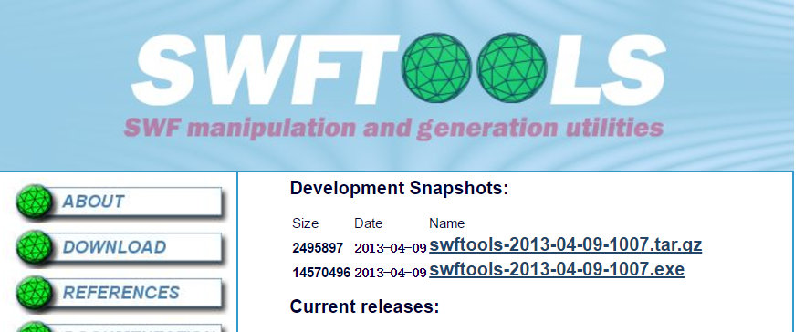
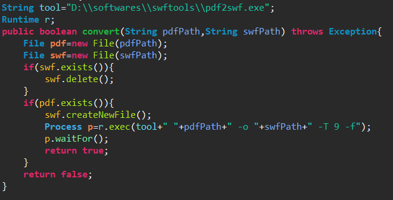
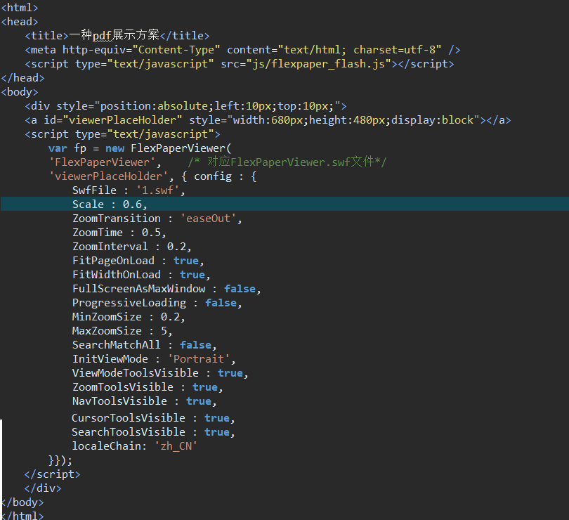
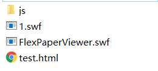
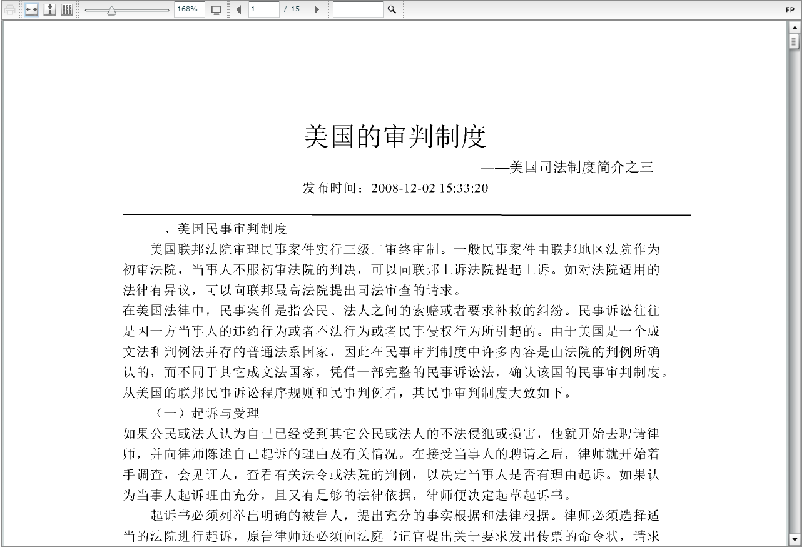

# 一种pdf展示方案：FLexPaper
Author: 汤航

Date: 2019/3/25
##  引言
如果想要在网页中展示PDF，但是不希望他人下载或打印这些PDF，该如何实现呢？在网页中展示PDF有很多方案：
A、    首先< object >、< embed >、< iframe >这几个标签就能实现PDF文件的预览（无需JavaScript支持）
B、    我还在网上看了下发现挺多第三方js库可以实现PDF预览，如jQuery Document Viewer、jquery.media.js、PDFObject、PDF.js等等。我大概看了下PDFObject、PDF.js这两个库，前者并不是一个PDF的渲染工具，而是通过使用< embed >标签来显示PDF；后者则会解析PDF文件内容，还能将PDF渲染成Canvas。
C、    如道客巴巴一样，将pdf转成了flash显示。
其中，A类的做法展示的PDF渲染效果不佳，也无法调整PDF尺寸默认成自适应屏幕宽度，且必然可以打印PDF，但是可以禁用下载按钮；B类做法渲染效果可以，也能调整到自适应屏幕，可以禁用下载，通过js加挡板也可以实现禁止鼠标右键打印，但是仍然可以通过查看源代码的方法找到pdf地址进行下载；C类将PDF转成flash，效果不错，也能防止用户下载打印PDF，只是加载速度比不上第一种。
这里，就做一个C类做法的说明。
## 转换
下载swftools工具包：http://www.swftools.org/download.html，点选exe文件下载而后安装：
 
swftools工具包中的PDF2SWF工具可用来将PDF格式文件转换成SWF格式。使用下面的命令可以将pdf文件转换为单页swf文件。
　　pdf2swf.exe  pdfPath  –o swfPath  –T 9  –f。
　　pdf2swf为pdf2swf二进制命令的绝对路径；pdfpath为要进行转换的PDF文件的绝对路径；swfPath为转换后swf文件的路径；-T 9 用来设定转换的swf版本为9，这样设置是因为某些版本的swf文件并不能用flexpaper正常显示出来；-f在转换的文档每页中插入一帧，提高转换后文档的稳定性。
　　上述命令可直接在命令行中运行，实现pdf转换，如果想在Java中去进行pdf转换，做法如下： Java应用程序有一个Runtime类实例，使应用程序能够与其运行的环境相连接。应用程序不能创建自己的Runtime类实例，可以通过Runtime类的getRuntime方法获得当前运行时。获得Runtime类实例之后，即可以调用该类的exec方法创建一个新的进程来执行制定的字符串命令。因此，可以利用exec方法来调用之前所述的PDF2SWF命令来完成PDF至SWF文件的转换，代码如下：
  
　
## PDF展示
FlexPaper是一个开源轻量级的文档浏览组件，被设计和比如PDF2SWF库（包含于SWFTools）一起工作，使得在网页上，Adobe Flex以及别的基于Flash的应用程序中显示和交互PDF文件成为可能。即，使得在没有安装PDF阅读器软件的情况下浏览PDF文件成为可能。FlexPaper项目同时提供了Flex库和独立的Flash版本。
### 下载FlexPaper 
　　下载FlexPaper:FlexPaper在github上的项目地址为https://github.com/flexpaper/flexpaper。
下载后，我们只需要其中Example/flash中的js文件夹，复制到你的项目文件夹
### FlexPaper参数说明
•    SwfFile(String)：需要使用FlexPaper打开的文档
•    Scale(Number)：初始化缩放比例，参数值应该是大于零的整数（1=100%）
•    ZoomTransition(String)：FlexPaper中缩放样式，它使用和Tweener一样的样式，默认参数值为easeOut，其他可选值包括：easenone，easeout，linear，easeoutquad
•    ZoomTime(Number)：从一个缩放比例变为另外一个缩放比例需要花费的时间，该参数值应该为0或更大
•    ZoomInterval(Number)：缩放比例之间间隔，默认值为0.1，该值应该为正数
•    FitPageOnLoad(Boolean)：初始化时自适应页面，与使用工具栏上的适应页面按钮同样的效果
•    FitWidthOnLoad(Boolean)：初始化时自适应页面宽度，与工具栏上的适应宽度按钮同样的效果
•    localeChain(String)：设置地区（语言），目前支持一下语言：
en_US (English)
fr_FR (French)
zh_CN (Chinese,Simple)
es_ES (Spanish)
pt_BR (Brazilian Portugese)
ru_RU (Russian)
fi_FN (FInnish)
de_DE (German)
nl_NL (Netherlands)
tr_TR (Turkish)
se_SE (Swedish)
pt_PT (Portugese)
el_EL (Greek)
da_DN (Danish)
cz_CS (Czech)
it_IT (Italian)
pl_PL (Polish)
pv_FN (Finish)
hu_HU (Hungarian)
•    FullScreenAsMaxWindow(Boolean)：当设置为true时，单击全拼按钮会打开一个FlexPaper最大化的新窗口而不是全屏，当由于flash播放器因为安全而禁止全屏，而使用flexpaper作为独立的flash播放器的时候设置为true是个优先选择
•    ProgressiveLoading(Boolean)：当设置为true时，展示文档时不会加载完整个文档，而是逐步加载，但是需要将文档中转化为9以上的版本（使用pdf2swf的时候使用-T 9标签）
•    MaxZoomSize(Number)：设置最大的缩放比例
•    MinZoomSize(Number)：设置最小的缩放比例
•    SearchMatchAll(Boolean)：设置为true时，单击搜索所有符合条件的地方高亮显示
•    InitViewMode(String)：设置启动模式如“Portrait”或“TowPage”
•    ViewModeToolsVisible(Boolean)：工具栏上是否显示样式选择框
•    ZoomToolsVisible(Boolean)：工具栏上时候显示缩放工具
•    NavToolsVisible(Boolean)：工具栏上是否显示导航工具
•    CursorToolsVisible(Boolean)：工具栏上是否显示光标工具
•    SearchToolsVisible(Boolean)：工具栏上是否显示搜索工具
### FlexPaper例子
创建html页面test.html，代码如下：
  
test.html文件以及需要的js，swf文件组织结构如下图所示：
 
test.html文件组织结构
　　显示1.swf文件的效果如下图所示：
  
FlexPaper下显示Paper.swf效果，可以看到显示效果不错，自动适应页面宽度，且不可打印，不可下载。
## 问题及解决
### 打印问题
将参数中所有toolvisible选项都设置为false，还有PrintEnabled : false，这样久能避免用户打印。

### 转换为flash时的乱码问题
pdf2swf默认没有多语言支持，直接执行有可能报如下错误：
Error: Unknown character collection 'Adobe-GB1'
Error: Couldn't find a font for 'HeiseiMin-W3-90ms-RKSJ-H'
需要添加xpdf语言包进行支持，步骤如下：
1.下载语言包，http://www.foolabs.com/xpdf/download.html
2.以中文为例，解压至C:\App\xpdf\xpdf-chinese-simplified
修改C:\App\xpdf\xpdf-chinese-simplified\add-to-xpdfrc，将/usr/…的linux路径改为正确的windows路径
3.新建文件C:\App\xpdf\add-to-xpdfrc，内容为：
include C:\App\xpdf\xpdf-chinese-simplified\add-to-xpdfrc
include C:\App\xpdf\xpdf-japanese\add-to-xpdfrc
4.下载所需的字体，比如日语字体'HeiseiMin-W3-90ms-RKSJ-H'的kochi-mincho-subst.ttf，我在这里下载的。中文在这里。
5.修改C:\App\xpdf\xpdf-japanese\add-to-xpdfrc，增加一行displayCIDFontTT Adobe-Japan1 C:\App\xpdf\font\kochi-mincho-subst.ttf
6.测试
pdf2swf -P root -s languagedir=C:\App\xpdf  "C:\Users\Administrator\Desktop\swftools test\japanese.pdf" -o "C:\Users\Administrator\Desktop\swftools test\x.swf"
NOTICE  Adding C:\App\xpdf to language pack directories
NOTICE  processing PDF page 1 (842x595:0:0)
NOTICE  Writing SWF file C:\Users\Administrator\Desktop\swftools test\x.swf
没有错误了。
