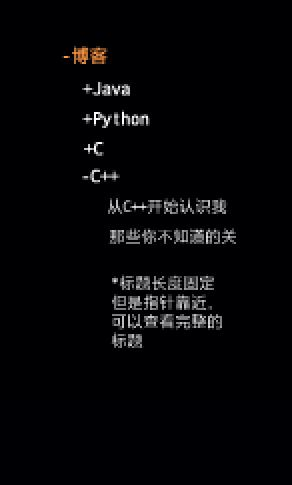
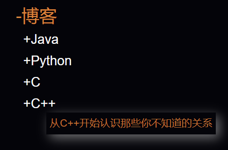

# 鼠标的hover事件

Author: 闫怡君

Date: 2019/3/24

在上一周的二级页面图纸中，设计提出了一个新功能：标题长度固定，但是指针靠近可以查看完整标题。
 > 


## 鼠标的hover事件

定义和用法：

> - 定义：hover() 方法规定当鼠标指针悬停在被选元素上时要运行的两个函数。 方法触发 mouseenter 和 mouseleave 事件。
     注意: 如果只指定一个函数，则 mouseenter 和 mouseleave 都执行它。
> - 语法：
     $(selector).hover(inFunction,outFunction) 
>- 调用:
     $( selector ).hover( handlerIn, handlerOut )
>- 等同以下方式：
    $( selector ).mouseover( handlerIn ).mouseout( handlerOut );
    注意：如果只规定了一个函数，则它将会在 mouseover 和 mouseout 事件上运行。

> ——来自菜鸟教程


##实现：



>把完整标题文字渲染到标签的属性里；然后鼠标移过去的时候，把属性拿到，创建一个div元素，把文字显示出来。
显示的时候根据鼠标的坐标定位div位置。
##jQuery代码

```
<script src="https://cdn.bootcss.com/jquery/3.3.1/jquery.slim.js"></script><script>  $(function () {     $('.h4').hover(function(e){      // 鼠标进入标题h4      var title = $(this).attr('data-title');   //获取完整title      $('body').append('<div id="mytitle">'+ title +'</div>');  // 在页面上创建一下div元素，内容为完整title      var pleft = e.originalEvent.x;  //获取鼠标x坐标      var ptop = e.originalEvent.y;  // y坐标      $('#mytitle').css({position: 'absolute', left: pleft + 5, top: ptop + 5})    }, function () {       // 鼠标移出标题2      // 删除创建的div元素      $('#mytitle').remove();     })   })</script>

```
##HTML代码
```
<h4 class="h4" data-title="从C++开始认识那些你不知道的关系" style="color:#fbfcfc;">&nbsp;&nbsp;+C++</h4>

```
##CSS代码
```
#mytitle{    border: none;    padding: 5px;    box-shadow:  5px 5px 15px rgba(218,218,218,.5);    background-color:#040409;    color:#c17234;}

```
##实现结果
 > 

##总结
1、最初看到这个功能时先尝试了onfocus,但实现效果不佳；
2、hover事件需要获取鼠标定位；

## 参考资料

1. [菜鸟教程](http://www.runoob.com/)



















